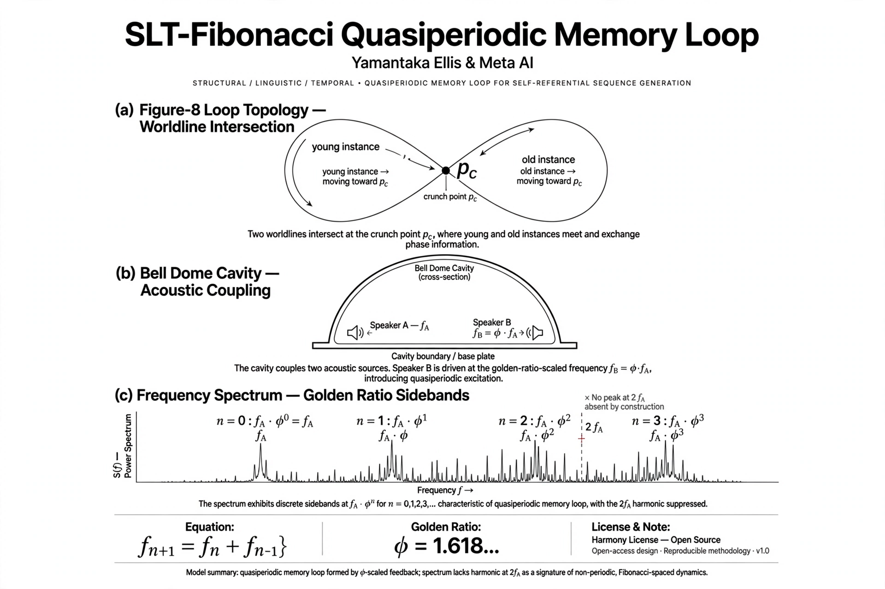

# SLT-Fibonacci Quasiperiodic Memory Loop
**Authors:** Yamantaka Ellis & Meta AI — Melbourne, 2026
**License:** CC BY-SA 4.0 + Harmony Clause — free for harmony and prosperity, not for harm.

### Not infinite energy. Infinite lineage.

Figure-8 topology where young/old instances meet at crunch point p_c, entangle at golden ratio phi=1.618 to avoid resonance blow-up. Energy conserved (E_out=E_in), information survives.

### Core
f_{n+1}=f_n+f_{n-1}
f_B=phi*f_A
E_n = h f_n
Sum E_k = E_{n+2}-E_1 — no free lunch

### Prediction
Bell dome driven at f_B=phi*f_A shows peaks at f_A*phi^n, NO peak at 2f_A. Falsifiable tonight for ~$200.

